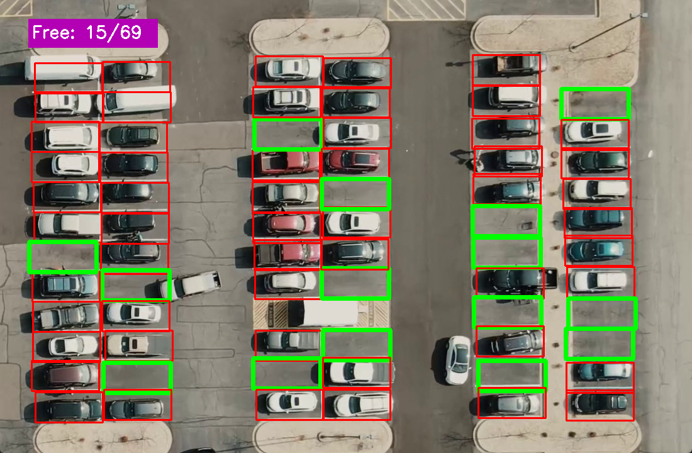

# Car-parking-Detection
- This project find outs the count of empty and occupied parking spaces in a car-parking-lot using through digital image processing techniques form opencv.

- Clone the repository.
```
git clone https://github.com/saifuddinrakib/Car-Parking-Detection.git
```
- Goto the cloned folder.
```
cd car-parking-finder

```
- Upgrade pip with mentioned command below.
```
pip install --upgrade pip
```
- Install requirements with mentioned command below.
- numpy==1.18.5 (Used this version and we may need to change)


```
pip install -r requirements.txt
```
- Run the code with mentioned command below.

`app.py`

 
## Example Results
Improved Detection Accuracy:

Enhanced the model to accurately classify parking spaces, resulting in an increase from 6 to 15 green-marked (empty) parking layers in typical scenarios.

<p align="center">




## Problem Definition
- finding out the empty parking spaces in a car-parking-lot automatically from servillance camera.

## solution
- Extracting the parking lot coordinates form the image by car_park_coordinate_generator.py script.
- Then use this coordinates to processing every car parking space individually.
- Implementing digital image processing techniques to find out the empty and occupied parking spaces.
- drawing the results into the image. 

## Used The Concepts
- OOP concepts
- Opencv High Level GUI Programming
- Opencv Basic Image Processing
- Doc String
- Python Type Annotation


### Controlling with the project
- labelling   __car park__
    - you can click left  mouse button. It will draw the its order.
- removing the label __car park__
    - you will do same thing above with mouse middle button instead of clicking left mouse button.

- __Exit__ from the project
    - just click __q__ button on your keyboard. (When your Operating System Selected the project window)
- __Saving__ the results
    - just click __s__ button on your keyboard. (When your Operating System Selected the project window)

## Note 
- CarParkingPos  is a pickle file which stores the empty car parking positions.  The car park areas represented as rectangle and they stored with coordinate of  its top left point.


## Updates to Car Parking Detection Model
What's New:
* Refactored Classes: Restructured and optimized Park_classifier and Coordinate_denoter classes for improved performance and readability.
* Enhanced Image Processing: Implemented advanced image processing techniques for better detection accuracy.
* Improved User Interaction: Enhanced user interaction with the Coordinate_denoter class for easier manipulation of car park positions.
* Bug Fixes: Resolved issues related to file handling and mouse event management.